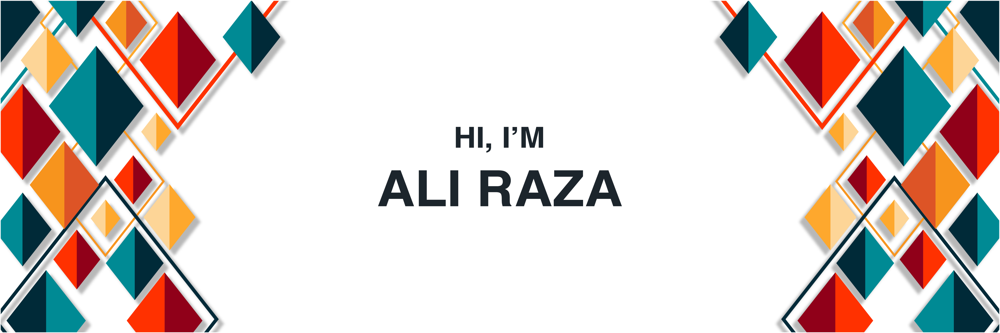

Whatever I do, I do with perfection, Take work ethics very seriously, Love to lead people, Help them to achieve their goals, and consistently look for innovative something for improving the lives of people.
 
<h4 align="center"> 💻 Full Stack Developer</h4>
 

 
 <!-- a href="https://github.com/Ali-Raza-Arain/" title="Ali Raza Arain"></a -->
<!--  <a href="https://mail.google.com/mail/u/0/?fs=1&to=ali445559391@gmail.com&su=&tf=cm" title="ali445559391@gmail.com"> -->
 <a href="mailto:ali445559391@gmail.com?subject=Github Visitor&body=Dear%20[Ali%20Raza],%0A%0AI%20hope%20this%20message%20finds%20you%20well.%0A%0AMy%20name%20is%20[Your%20Name],%20and%20I%20am%20reaching%20out%20to%20you%20regarding%20your%20work%20on%20GitHub.%20I%20have%20been%20following%20your%20projects%20and%20am%20impressed%20by%20[mention%20specific%20project%20or%20aspect%20of%20their%20work].%0A%0AI%20would%20appreciate%20the%20opportunity%20to%20connect%20and%20discuss%20[briefly%20state%20the%20purpose,%20e.g.,%20collaboration,%20questions%20about%20your%20project,%20etc.].%0A%0AThank%20you%20for%20your%20time,%20and%20I%20look%20forward%20to%20hearing%20from%20you.%0A%0ABest%20regards,%0A[Your%20Name]%0A[Your%20GitHub%20Profile%20Link]">
  
 </a>
  
 

