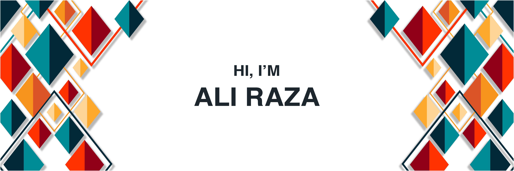

<h3 align="center">Software Engineer | Systems & AI Specialist</h3>

Whatever I do, I do with perfection. I take work ethics very seriously, love to lead people, help them achieve their goals, and consistently look for innovative ways to improve lives.

<h4 align="center"><ins>Open Source & Projects</ins></h4>
<!-- 
A collection of tools and systems I've built for developers and real-world use cases.
 -->

    <table>
        <thead>
            <tr>
                <th align="center">Project</th>
                <th align="center">About</th>
                <th align="center">Stats</th>
                <th align="center">Quick Start</th>
            </tr>
        </thead>
        <tbody>
            <tr>
                <td align="center" width="160">
                    
                </td>
                <td>
                    <b>Project Tracking & Task Organization</b> 
                    Silently track every terminal command per project — auto-captured, filtered, and instantly replayable
                </td>
                <td align="center" width="200">
                     
                     
                </td>
                <td align="center" width="200">
                    <code>npm i proj-track</code>
                </td>
            </tr>
            <tr>
                <td align="center">
                    
                </td>
                <td>
                    <b>LLM Cost Monitoring & Budget Protection</b> 
                    Enforces real-time token budgets for OpenAI, Anthropic, and Gemini API calls
                </td>
                <td align="center">
                     
                     
                </td>
                <td align="center">
                    <code>npm i llm-spend-guard</code>
                </td>
            </tr>
            <tr>
                <td align="center">
                    
                </td>
                <td>
                    <b>Intelligent HTTP Client</b> 
                    Production-grade fetch wrapper that makes HTTP requests resilient, intelligent, and effortless
                </td>
                <td align="center">
                     
                     
                </td>
                <td align="center">
                    <code>npm i fetch-smartly</code>
                </td>
            </tr>
            <tr>
                <td align="center">
                    
                </td>
                <td>
                    <b>NPM Analytics Dashboard</b> 
                    Visual analytics and insights for the NPM ecosystem — explore package trends, downloads, and more
                </td>
                <td align="center">
                     
                    
                </td>
                <td align="center">
                    
                </td>
            </tr>
            <tr>
                <td align="center">
                    
                </td>
                <td>
                    <b>Claude Code Workflow Insights</b> 
                    Config-driven status line studio for Claude Code with TUI customization and 40+ widgets.
                </td>
                <td align="center">
                     
                </td>
                <td align="center">
                    
                </td>
            </tr>
        </tbody>
    </table>

     
    
    
    <a href="mailto:ali445559391@gmail.com?subject=Github Visitor&body=Dear%20[Ali%20Raza],%0A%0AI%20hope%20this%20message%20finds%20you%20well.%0A%0AMy%20name%20is%20[Your%20Name],%20and%20I%20am%20reaching%20out%20to%20you%20regarding%20your%20work%20on%20GitHub.%20I%20have%20been%20following%20your%20projects%20and%20am%20impressed%20by%20[mention%20specific%20project%20or%20aspect%20of%20their%20work].%0A%0AI%20would%20appreciate%20the%20opportunity%20to%20connect%20and%20discuss%20[briefly%20state%20the%20purpose,%20e.g.,%20collaboration,%20questions%20about%20your%20project,%20etc.].%0A%0AThank%20you%20for%20your%20time,%20and%20I%20look%20forward%20to%20hearing%20from%20you.%0A%0ABest%20regards,%0A[Your%20Name]%0A[Your%20GitHub%20Profile%20Link]" title="Ali Raza's Email">
        
    </a>
     
    
     
    

